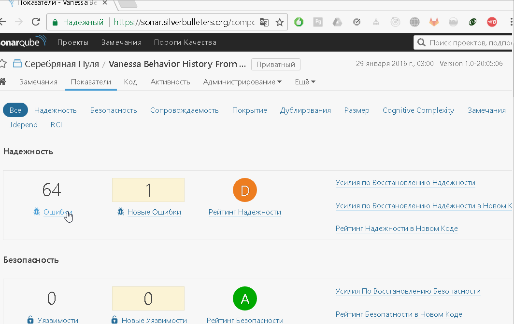

## Analyze history of git repo with SonarQube 

simply run:

* install docker
* clone the your repo in some place
* create file `.env` in your repo with this content
```
SONAR_SCANNER_OPTS=-Xmx512m (or some additional scanner opts)
SONAR_SERVER_URL=<your-sonarserver-url>
SONAR_TOKEN=<yourapitoken>
START_DATE=0001-01-01
```
* checkout branch from `origin/some-branch`
  * dont forget fill `sonar-project.properties` in your project
* run command specified on your OS

[](https://hub.docker.com/r/silverbulleters/sonar-history-runner/)
[](https://hub.docker.com/r/silverbulleters/sonar-history-runner/)

### Linux

```
docker run -it --rm --env-file=.env -v "$PWD":/gitrepo silverbulleters/sonar-history-runner
```

### Windows

create `bat` file with this conent

```
set CURPWD=%cd%
set CURPWD=%CURPWD:\=/%

docker run -it --rm --env-file=.env -v "%CURPWD%":/gitrepo silverbulleters/sonar-history-runner
```

and run it

note: on docker for windows there is strange behavior with mount localdrive with PWD command, thants why run command so strange

### Debug run

* enter to container bash `docker run -it --rm --env-file=.env -v "%CURPWD%":/gitrepo silverbulleters/sonar-history-runner bash`
* run `./sonar-runner` 

### For what

* if you start use SonarQube for your git repo yo may want to load your tech debt from first commit to current date

### How to

for that we need to do some steps

* get the git history
* checkout each revision
* analyze it with sonar-runner with changed project date
* push analyze to sonar server

### Tech info

* we use an docker image with jdk8, maven and sonar - see official maven image https://hub.docker.com/_/maven/
* we use additional parameter `-Dsonar.projectDate=` to bring you in history


## Useful link

* simple example by tags https://gist.github.com/aslakknutsen/2422117
* official docs for scanner https://docs.sonarqube.org/display/SCAN/Analyzing+with+SonarQube+Scanner
* advanced usage of sonar scaner https://docs.sonarqube.org/display/SCAN/Advanced+SonarQube+Scanner+Usages

## Limitation

if you have many revision in one day - you may see analyze error on sonarqube with this content

```
Validation of project failed:
  o Date of analysis cannot be older than the date of the last known analysis on this project. Value: 
```

this is not bug, this is a limitation of sonar.projectDate parameter - you may set only date, not time in this parametr  

[](https://hub.docker.com/r/silverbulleters/sonar-history-runner/)

### For Russian Users

Данный проект реализован для "ввода остатков" технического долга на основе вашего git репозитория и используется в следующих кейсах

#### Для 1С и SonarQube

* Вы используйте gitsync - https://github.com/oscript-library/gitsync
* Вы решили использовать наш плагин для 1С - https://github.com/silverbulleters/sonar-1c-bsl-public
* Вам нужно проанализировать историю вашего кода с момента использования Git для 1С

#### Для других языков

* Вы использовали GIT
* Вы только недавно прочитали статью про SonarQube
* Вы решили ввести остатки своего технического долга

## GIFs

after analyze you may see your history


